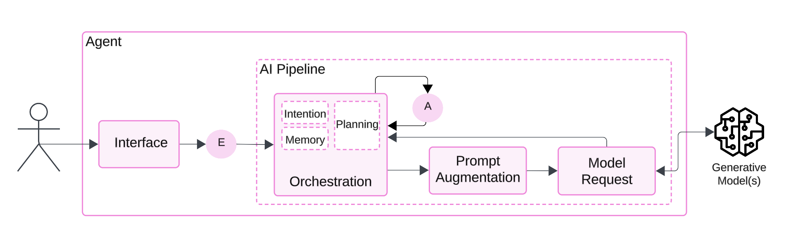

### [Home](README.md) | [Projects](PROJECTS.md) | [Publications](KNOWLEDGE.md#publications) | [Education](KNOWLEDGE.md#education) | [Team](PEOPLE.md) |  [Join Us](JOIN.md)

## Exercises

These exercises are designed to reflect real-world business scenarios and challenges, showcasing how Generative Intelligence Systems are applied across diverse industries. You will gain hands-on experience by working with solutions grounded in industry-standard frameworks and best practices.

Resources:

* [Use Case Compendium](https://docs.google.com/spreadsheets/d/1Ge2chxRrBjILHkZthtzymqAbs3TkwrGiMMge23zC8jA/edit?usp=sharing): open-science list of industry use cases compiled from exchanges with experts, publications, and experiences.
* [Generative Intelligence Systems](https://medium.com/generative-intelligence-lab/generative-intelligence-systems-concepts-and-research-opportunities-0740b1b5c7eb): community article explaining these systems, research questions, and opportunities for research.
* [Owlmind](https://github.com/genilab-fau/owlmind): framework for fast-prototyping of Generative Intelligence Systems.

## How to implement the exercises?

These exercises are built for fast prototyping, using configurations based on our toolkits. You will make use of our [Owlmind](https://github.com/genilab-fau/owlmind) framework for experimentation and education, local model providers (e.g., [Ollama](http://www.ollama.com)), and [Discord Bots](http://www.discord.com) - so you can focus on system logic without spending time designing user interfaces.

To begin working on the exercises, follow these steps:

1. **Understand the core components of Generative Intelligence Systems**. Explore our check our publications at [Publications by the Generative Intelligence Lab](https://medium.com/generative-intelligence-lab), especially the article on [Generative Intelligence Systems](https://medium.com/generative-intelligence-lab/generative-intelligence-systems-concepts-and-research-opportunities-0740b1b5c7eb).

1.  **Install [Owlmind](https://github.com/genilab-fau/owlmind)**; this framework accelerates your prototyping process and supports a wide range of GenAI workflows.

1. **Set up your Discord Bot and connect it to the [Owlmind](https://github.com/genilab-fau/owlmind)** framework running on your target Discord server. Step-by-step setup instructions are included in the repository.

1. (optionally) **Install or configure a Model provider**; for example [Ollama](http://www.ollama.com); Owlmind includes guides for integrating with providers.

1. Define your Use Case Prototype:
    * What should the bot application do?
    * What interactions should it support?
    * How will it deliver those interactions?
    * What GenAI techniques will be used?
    * Prompt Augmentation
    * Retrieval-Augmented Generation (RAG)
    * Prompt + Action (artifacts)
    * Multi-Agent Systems
    * Or a combination?

1. Decide which parts of the framework to configure:
    * Agent orchestration rules
    * Prompt augmentation workflows
    * RAG modules
    * Model provider and specific model (e.g., Llama 3.2)
    * Model parameters (e.g., temperature, context window size, etc.)

1. If required, compile the Datasets required for the experiments.

1. Deploy your setup: 
    * Configure Owlmind
    * Deploy your Discord Bot
    * Load your datasets, and;
    * Start testing your use case!

## Check Also

* [Publications](KNOWLEDGE.md#publications)
* [Education](KNOWLEDGE.md#education)
* [Resources](PROJECTS.md#resources)
* [Projects](PROJECTS.md)
* [Contributing](CONTRIBUTE.md)
* [Team](PEOPLE.md)
* [Join Us](JOIN.md)
  
  
