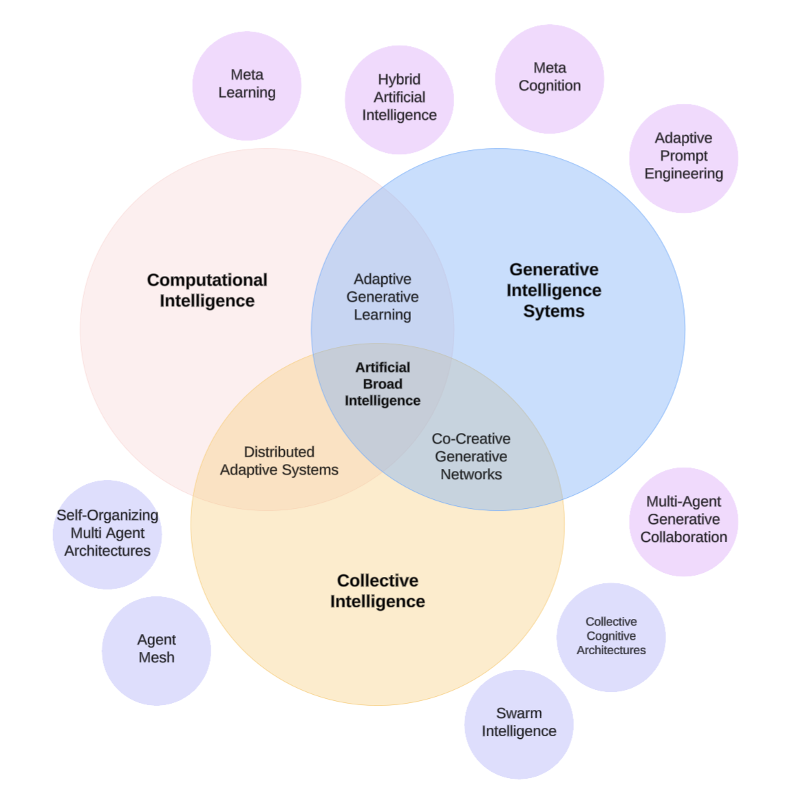

### [Home](README.md) | [Projects](PROJECTS.md) | [Publications](KNOWLEDGE.md#publications) | [Education](KNOWLEDGE.md#education) | [Team](PEOPLE.md) |  [Join Us](JOINING.md)

## Publications

The Generative Intelligence Lab promotes knowledge transfer through technical reports, scientific publications, and educational activities. We support the following initiatives:

* [Publications by the Generative Intelligence Lab](https://medium.com/generative-intelligence-lab) is a venue to promote publications that communicate our research insights, practical use cases, and experimental findings. 
* [Research Community Papers](https://medium.com/generative-intelligence-lab/community-papers-series-ebacc91b47ea) explain the topics around our key research focus, providing an overview around the concepts, research challenges, and ideas for research projects. Selected topics:
    * Computational Intelligence.
    * Generative Intelligent Systems.
    * [Collective Intelligence](https://medium.com/generative-intelligence-lab/collective-intelligence-concepts-and-research-opportunities-6130ef044114).

<!--  --> 

<!-- ## Scientific Publications -->

## Education

These are courses taught by Dr. Koch applying [Research Resources](./PROJECTS.md#resources) and expertise from the lab:

* [COT6930](https://fau.simplesyllabus.com/en-US/doc/nre6c4z6g/Spring-2025-1-Full-Term-COT-6930-001-Topics-in-Computer-Science?mode=view): Generative Artificial Intelligence and Software Development Lifecycles
* [CEN 4010](https://fau.simplesyllabus.com/doc/yolipf0x2/Spring-2025-1-Full-Term-CEN-4010-001-Prin-Software-Engineering?mode=view): Principles of Software Engineering with Generative Intelligence
* [CAP4623](https://fau.simplesyllabus.com/en-US/doc/h6c9776hw/Fall-2024-1-Full-Term-CAP-4623-001-?mode=view): Trustworthy Artificial Intelligence

## Check Also

* [Resources](PROJECTS.md#resources)
* [Projects](PROJECTS.md)
* [Use Cases](PROJECTS.md#use-cases)
* [Project Ideas](JOINING.md#project-ideas)
* [Exercises](EXERCISES.md)
* [Contributing](CONTRIBUTING.md)
* [Team](PEOPLE.md)
* [Join Us](JOINING.md)
  
