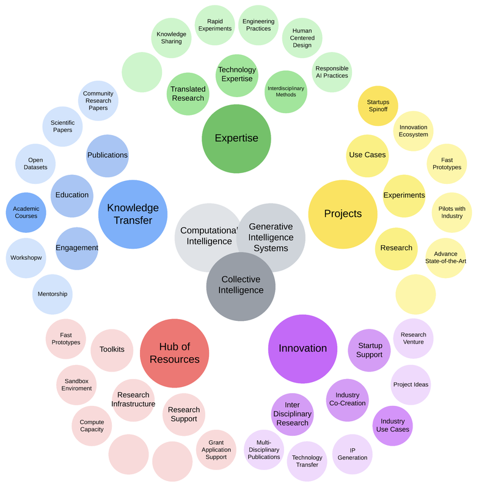

### [Home](README.md) | [Projects](PROJECTS.md) | [Publications](KNOWLEDGE.md) | [Education](KNOWLEDGE.md#education) | [Team](PEOPLE.md) |  [Join Us](JOIN.md)

The Generative Intelligence Lab in the Department of Electrical Engineering and Computer Sciences at FAU supports the design, development, and deployment of research-driven [Generative Intelligence Systems](https://medium.com/generative-intelligence-lab/generative-intelligence-systems-concepts-and-research-opportunities-0740b1b5c7eb) for our research communities and industry partners.

<h3 style="color:#2B65CF">We are builders of Generative Intelligence Systems!</h3>

We operate as **a software factory for Generative Intelligence Systems in Multi-Disciplinary Research Applications** using specialized toolkits to connect solution requirements, prompts, pipelines, and models. Key to our success is the **adoption of rapid prototyping processes and solutions**. We pride ourselves on being able to develop GenAI-powered systems fast and robustly.

<h3 style="color:#2B65CF">Advancing open science and the creative economy!</h3>

Our lab provides [Research Resources](./PROJECTS#resources) tailored to emerging use cases. From intelligent chatbots to well-architected multi-agent systems, and domain-specific models, these solutions are designed to serve as foundational tools for accelerating discovery, enhancing decision-making, and amplifying human creativity.

We champion [open science and knowledge transfer](./KNOWLEDGE.md) through technical reports, academic publications, and educational programs. We continuously develop and share [projects](./PROJECTS) and [practical exercises](./EXERCISES.md) tied to real-world challenges. We are driven by **technology transfer, ecosystem development, and launching the next generation of startups**.

## Expertise

Our expertise and research interests lie in the intersection between:

* [**Generative Intelligence Systems:**](https://medium.com/generative-intelligence-lab/generative-intelligence-systems-concepts-and-research-opportunities-0740b1b5c7eb) design systems that generate meaningful actions using Prompts, Pipelines, and  Generative Models, eventually integrated in Multi-Agent Systems.

* [**Computational Intelligence:**](https://medium.com/generative-intelligence-lab/computational-intelligence-concepts-and-research-opportunities-c32d4a65eddb) build adaptive systems that learn and self-organize to handle complex, real-world challenges. This is the core of Artificial Intelligent Systems and a step toward Artificial Broad Intelligence.

* **[Collective Intelligence](https://medium.com/generative-intelligence-lab/collective-intelligence-concepts-and-research-opportunities-6130ef044114)**: creating distributed systems that collaborate across agents to solve problems and evolve as a unified whole. This includes Multi-Agent Systems and Human-Agent interaction solutions.

## Check Also

* [Publications](KNOWLEDGE.md#publications)
* [Education](KNOWLEDGE.md#education)
* [Resources](PROJECTS.md#resources)
* [Projects](PROJECTS.md)
* [Exercises](EXERCISES.md)
* [Contributing](CONTRIBUTE.md)
* [Team](PEOPLE.md)
* [Join Us](JOIN.md)

  

