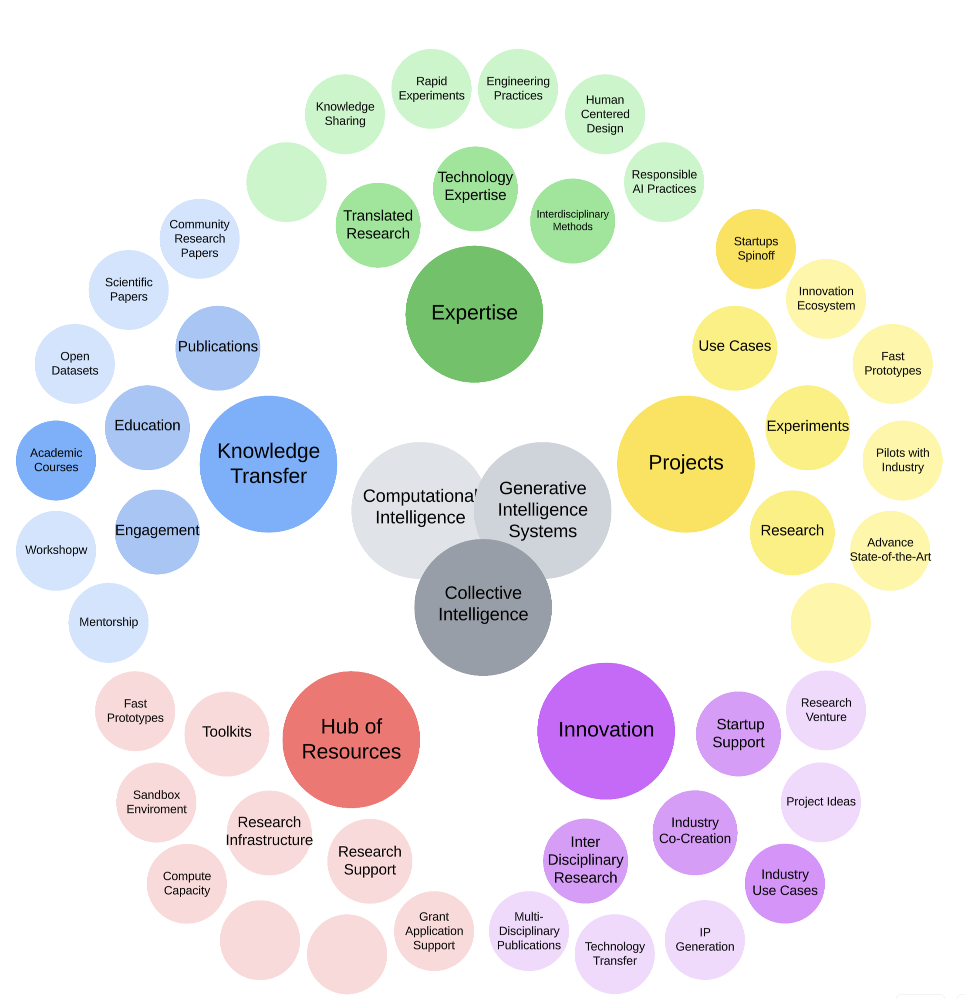

### [Home](README.md) | [Projects](PROJECTS.md) | [Publications](KNOWLEDGE.md#publications) | [Education](KNOWLEDGE.md#education) | [Team](PEOPLE.md) |  [Join Us](JOINING.md)

The Generative Intelligence Lab is dedicated to the research-driven development of Generative Intelligence Systems that delivers [research contribution, business innovation, and social impact](./PROJECTS.md).

We operate as **a software factory for Generative Intelligence Systems** aiming to fast track innovation by translating research into real-world impact! We bring together expertise and specialized [toolkits](./PROJECTS#resources) to connect solution requirements, prompts, pipelines, and models.

### We are builders of Generative Intelligence Systems

We support rapid experimentation with GenAI-powered, multidisciplinary research applications. Our Lab provides [Research Resources](./PROJECTS#resources)  tailored to emerging use cases. From intelligent chatbots to well-architected multi-agent systems and specialized models, our systems are built to serve as foundational tools for accelerating discovery, enhancing decision-making, and amplifying human creativity.

The Lab promotes [knowledge transfer](./KNOWLEDGE.md) through technical reports, scientific publications, and educational initiatives.  We actively develop and share [projects](./PROJECTS#use-cases) and [exercises](./EXERCISES.md#industry-use-cases) aligned industry use cases. Our focus is on **technology transfer, supporting the innovation ecosystem, and spinning out startups.**

<!-- invitation to collaborators -->

## Expertise

[Our expertise](KNOWLEDGE.md) and research interests lie in the intersection between:

* **Generative Intelligence Systems:** design systems that generate meaningful actions using Prompts, Pipelines, and  Generative Models, eventually integrated in Multi-Agent Systems.
* **Computational Intelligence:** build adaptive systems that learn and self-organize to handle complex, real-world challenges. This is the core of Artificial Intelligent Systems and a step toward Artificial Broad Intelligence.
* **[Collective Intelligence](https://medium.com/generative-intelligence-lab/collective-intelligence-concepts-and-research-opportunities-6130ef044114)**: creating distributed systems that collaborate across agents to solve problems and evolve as a unified whole. This includes Multi-Agent Systems and Human-Agent interaction solutions.

<!-- # Impact -->

## Check Also

* [Publications](KNOWLEDGE.md#publications)
* [Education](KNOWLEDGE.md#education)
* [Resources](PROJECTS.md#resources)
* [Projects](PROJECTS.md)
* [Use Cases](PROJECTS.md#use-cases)
* [Project Ideas](JOINING.md#project-ideas)
* [Exercises](EXERCISES.md)
* [Contributing](CONTRIBUTING.md)
* [Team](PEOPLE.md)
* [Join Us](JOINING.md)

  

