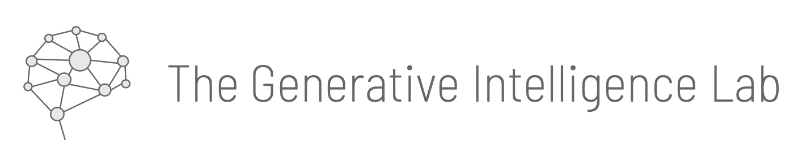

The Generative Intelligence Lab in the Department of Electrical Engineering and Computer Sciences at FAU supports the ideation, design, and deployment of research-driven Generative Intelligence Systems for our research community and industry partners.

### We are thinkers and builders of Generative Intelligence Systems!

We operate between a *Think Tank* and a *Development Studio* in multi-disciplinary research projects. 
We can quickly prototype solutions like:

* *Data analytic* to simplify exploration, understanding, analysis of daasets. 
* *Chatbots* for personal assistants in diverse fields.
* *Ask Document*, allowing natural interaction with non-structure documents. 
* *Ask Data*, supporting personal assistance while exploring large datasets.
* *Multi-user Interactions*, supporting GenAI-powered experiments with Collective Intelligence
(and more)

<a href="./projects.html" class="cta-button">Bring in Ideas</a>
<a href="./collaborate.html" class="cta-button">Join Us</a>

## Academic Partners

<main>

  
  

</main>

 ## Industry Partners
 
 <main>
 

   
   
   

</main>

### Check Also

* [Tutorials](./knowledge.md#tutorials)
* [Projects](./projects.md)
* [Resources](./projects.md#resources) 
* [Education](./knowledge.md#education)
* [Publications](./knowledge.md#publications)
* [Join us](./collaborate.md)
* [Team](./people.html)

 

