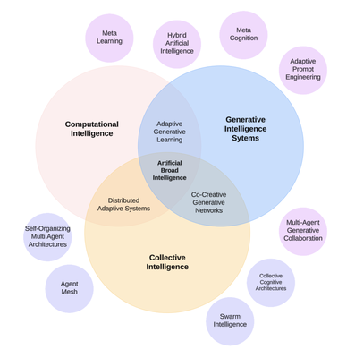

### [Home](./index.md) | [Projects](./projects.md) | [Publications](./knowledge.md) | [Education](./knowledge.md#education) | [Team](./people.html) | [Collaborate](./collaborate.md)

## Areas of Interest

The Generative Intelligence Lab promotes knowledge transfer through technical reports, scientific publications, and educational initiatives spanning the intersecting domains of:

* [Generative Intelligence Systems](https://medium.com/generative-intelligence-lab/generative-intelligence-systems-concepts-and-research-opportunities-0740b1b5c7eb)
* [Computational Intelligence](https://medium.com/generative-intelligence-lab/computational-intelligence-concepts-and-research-opportunities-c32d4a65eddb)
* [Collective Intelligence](https://medium.com/generative-intelligence-lab/collective-intelligence-concepts-and-research-opportunities-6130ef044114). 

Our open publications include:

* [Publications by the Generative Intelligence Lab](https://medium.com/generative-intelligence-lab) is a venue to promote publications that communicate our research insights, practical use cases, and experimental findings. 
* [Research Community Papers](https://medium.com/generative-intelligence-lab/community-papers-series-ebacc91b47ea) explain the topics around our key research focus, providing an overview around the concepts, research challenges, and ideas for advanced research projects.

<!-- ## Scientific Publications -->

## Education

These are courses taught by Dr. Koch applying [Research Resources](./projects.md#resources) and expertise from the lab:

* [COT6930](https://fau.simplesyllabus.com/en-US/doc/nre6c4z6g/Spring-2025-1-Full-Term-COT-6930-001-Topics-in-Computer-Science?mode=view): Generative Artificial Intelligence and Software Development Lifecycles
* [CEN 4010](https://fau.simplesyllabus.com/doc/yolipf0x2/Spring-2025-1-Full-Term-CEN-4010-001-Prin-Software-Engineering?mode=view): Principles of Software Engineering with Generative Intelligence
* [CAP4623](https://fau.simplesyllabus.com/en-US/doc/h6c9776hw/Fall-2024-1-Full-Term-CAP-4623-001-?mode=view): Trustworthy Artificial Intelligence

### Check Also

* [Topics of Interest](./projects.md#topics-of-interest)
* [Projects](./projects.md)
* [Resources](./projects.md#resources)
* [Exercises](./exercises.md)
* [Contributing](./contribute.md)
* [Team](./people.html)
* [Collaborate](./collaborate.md)

 
