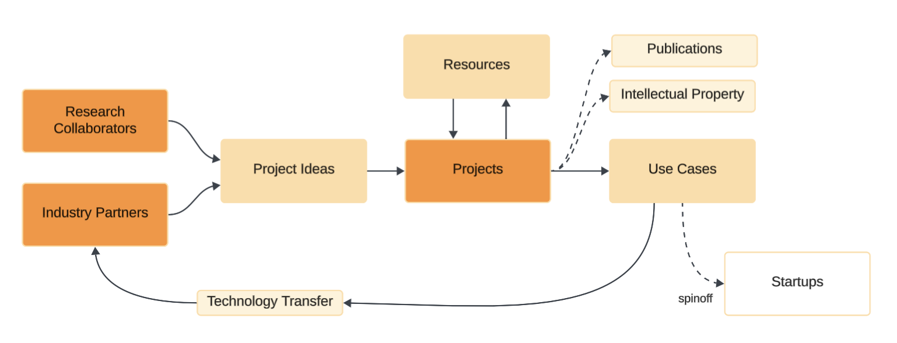

### [Home](./index.md) | [Projects](./projects.md) | [Publications](./knowledge.md) | [Education](./knowledge.md#education) | [Team](./people.html) | [Collaborate](./collaborate.md)

## Operation

The Generative Intelligence Lab is a group of builders working as a software factory for Generative Intelligence Systems in Multi-Disciplinary Research Applications and Industry Collaboration.

**We favor the development of projects around Multi-Disciplinary Collaboration** and with **Industry Partners**. If you have an idea for a project or [want to join as a collaborator](,.collaborate.md), reach out to [Dr. Koch](https://www.fau.edu/engineering/directory/faculty/koch/). 

## Resources

Our research toolkits are designed to support rapid experimentation and knowledge sharing. 

| | | 
| :-: | :- | 
|  | [**Owlmind**](https://github.com/genilab/owlmind)   Framework for Generative Intelligent Systems.   :: Bots + Prompts + Pipelines + Models = Fast Prototypes |
|  | [**Prompt Engineering Lab**](https://github.com/genilab/prompt-eng)   Fast prototype with Prompt Engineering techniques.   :: Prompts + Models = Quick Experiments | 
|  | [ChatFAU](https://chat.hpc.fau.edu)   Intelligent chat Interface based on [Ollama](http://ollama.com).   :: Our solution for zero-cost Model Provider :: | 

<!--
## Use Cases

We actively promote use cases aligned with real-world needs by applying our [Research Resources](./projects.md#resources) to fast-track prototyping and innovation. 

| | | |
| :-: | :-: | :-: | 
|    [**Collective Experience Systems**]() Multi-agent environments for  AI-human collaboration.  (submitted) |    [**Virtual Seller**]()   Let your customers   talk to your products.   (tbd) |    [**Right To Know**]()   Learn if your private data is  stored in commercial LLMs.   (tbd) |

-->

## Project Ideas

We publish our **Ideas for Projects** through:

* [**Use Case Compendium**](https://docs.google.com/spreadsheets/d/1Ge2chxRrBjILHkZthtzymqAbs3TkwrGiMMge23zC8jA/edit?usp=sharing): a curate, open-science list of industry use cases compiled from exchanges with experts, industry demands, and diverse publications.

* [**Research Community Papers**](https://medium.com/generative-intelligence-lab/community-papers-series-ebacc91b47ea): explain concepts around our key research focus, providing an overview around the concepts, research challenges.

* [**Exercises**](./exercises.md): open-science exercises for hobbyists and coursework.

## Topics of Interest 

This is a list of **Topics of Interest** where we are building capacity and toolkits. 

If you are interested in develop Use Cases around any of these topics,  please reach out to [Dr. Koch](https://www.fau.edu/engineering/directory/faculty/koch/)!

| | |
| :- | :- |
| **Smarter Health Systems** | Leveraging [Generative Intelligence Systems](https://medium.com/generative-intelligence-lab/generative-intelligence-systems-concepts-and-research-opportunities-0740b1b5c7eb) for personalized care planning, medical image synthesis, predictive diagnostics, and autonomous support systems — expanding access and enhancing decision-making in health services. |
| **Smarter Traffic Systems** | Applying [Generative Intelligence Systems](https://medium.com/generative-intelligence-lab/generative-intelligence-systems-concepts-and-research-opportunities-0740b1b5c7eb) to generate real-time traffic strategies, predict multimodal transport needs, and coordinate autonomous agents — reducing congestion and emissions through context-aware, adaptive mobility ecosystems. |
| **Smarter Control Systems** | Applying [Generative Intelligence Systems](https://medium.com/generative-intelligence-lab/generative-intelligence-systems-concepts-and-research-opportunities-0740b1b5c7eb) to develop better Control Systems able to model environmental, generate intervention strategies, and support distributed collaboration.
| **Smarter Education** | Using [Generative Intelligence Systems](https://medium.com/generative-intelligence-lab/generative-intelligence-systems-concepts-and-research-opportunities-0740b1b5c7eb) to co-create personalized learning paths, adaptive curricula, and intelligent tutoring systems that respond creatively to individual learning styles and educational goals. |
| **Smarter Cities** | Deploying [Generative Intelligence Systems](https://medium.com/generative-intelligence-lab/generative-intelligence-systems-concepts-and-research-opportunities-0740b1b5c7eb) to generate dynamic urban models, optimize resource flows, and co-design infrastructure that evolves with citizen needs — fostering more sustainable, resilient, and human-centered urban environments. |
| **Smarter Government** | Designing [Generative Intelligence Systems](https://medium.com/generative-intelligence-lab/generative-intelligence-systems-concepts-and-research-opportunities-0740b1b5c7eb) that can co-create public policies, model complex social dynamics, and support deliberative governance — enabling transparent, responsive, and participatory civic systems. Other topics of interest include: simulate policy outcomes, generate adaptive regulations, and co-create strategies with stakeholders — enabling more responsive, inclusive, and evidence-driven institutions.
| **Smarter Energy Systems** | Integrating [Generative Intelligence Systems](https://medium.com/generative-intelligence-lab/generative-intelligence-systems-concepts-and-research-opportunities-0740b1b5c7eb) to dynamically model energy demand, optimize renewable integration, and coordinate distributed energy agents — creating an intelligent, adaptive, and carbon-aware power grid. |
| **Smarter Cybersecurity** | Employing [Generative Intelligence Systems](https://medium.com/generative-intelligence-lab/generative-intelligence-systems-concepts-and-research-opportunities-0740b1b5c7eb) to simulate threat vectors, generate adaptive defense mechanisms, and anticipate complex cyber-attacks — building proactive, self-evolving security infrastructures. |
| **Smarter IT Systems** | Utilizing [Generative Intelligence Systems](https://medium.com/generative-intelligence-lab/generative-intelligence-systems-concepts-and-research-opportunities-0740b1b5c7eb) to autonomously generate configuration plans, optimize system architectures, and orchestrate multi-agent IT environments — enabling scalable, resilient, and self-adaptive digital ecosystems. |
| **Smarter Retail & Commerce** | Applying [Generative Intelligence Systems](https://medium.com/generative-intelligence-lab/generative-intelligence-systems-concepts-and-research-opportunities-0740b1b5c7eb) to generate hyper-personalized experiences, co-create marketing content, and simulate customer behavior — transforming how businesses engage, predict, and adapt to consumer needs. |
| **Smarter Science & Research** | Deploying [Generative Intelligence Systems](https://medium.com/generative-intelligence-lab/generative-intelligence-systems-concepts-and-research-opportunities-0740b1b5c7eb) to synthesize hypotheses, design experiments, and generate novel scientific insights — accelerating discovery across domains through creative, goal-aligned exploration. |

<!--
| **Smarter Law & Justice** | Using [Generative Intelligence Systems](https://medium.com/generative-intelligence-lab/generative-intelligence-systems-concepts-and-research-opportunities-0740b1b5c7eb) to interpret legal data, simulate legal outcomes, and generate case-specific legal reasoning — enhancing access, fairness, and efficiency in legal systems. |

| **Smarter Food & Agriculture** | Using [Generative Intelligence Systems](https://medium.com/generative-intelligence-lab/generative-intelligence-systems-concepts-and-research-opportunities-0740b1b5c7eb) to generate optimized crop plans, predict supply chain disruptions, and co-develop sustainable farming techniques — improving yield, resilience, and food security across ecosystems. |

-->

### Check Also

* [Topics of Interest](./projects.md#topics-of-interest)
* [Publications](./knowledge.md#publications)
* [Education](./knowledge.md#education)
* [Exercises](./exercises.md)
* [Contributing](./contribute.md)
* [Team](./people.html)
* [Collaborate](./collaborate.md)
